# Data Analysis

Draft notes on Diversity Perception Experiments.

## Data Cleaning

In this section, we discuss any data cleaning we performed on our dataset.

### Response Times

At first, we present response times per condition (logaritmic y-axis):

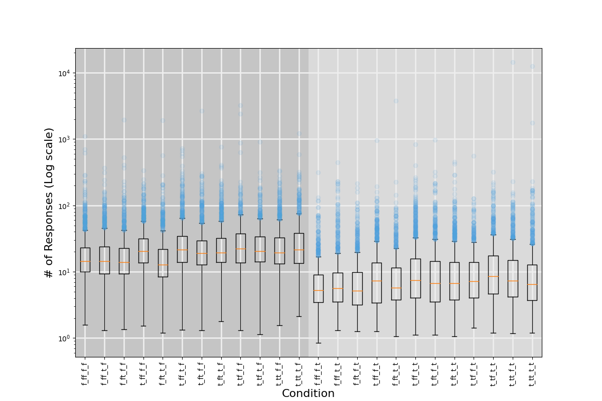

Evidently, tasks requiring users to build a sample take significantly much time compared to simple diversity recognition tasks. Apart from that, we observe that there are some outliers that seem to have take absurdly too long to complete. Namely, there exist several responses that seem to have taken more than 1000 seconds while one of them required roughly 10,000 seconds.

Given that, we proceed with a more in-depth analysis of response times. At first, we measure the average response time per participant as well as the corresponding standard deviations ($\mu$ and $\sigma$ respectively) and focus on participants that have provided at least one response in time $t$ such that $|t-\mu|>3\sigma$. Notably, there were 571 such participants so we had to refine our search criteria. After a second iteration we found out that for all these 571 participants it was true that $|t_k-\mu|\in(3\sigma,3.3\sigma)$, $k=1,\ldots,571$. Given the number of such users we decided to focus on users that had at least two "late" response (which we found to be 79). In file `outliers_3.json` one may find more details about which questions participants took more time to respond and in which conditions. There seems to appear no significant pattern in terms of conditions or responses, but for the fact that, for the vast majority of those participants, there was one "late" response in each condition. Also, surprisingly enough, it usually was not the first one &mdash; nor any particular response. Bearing in mind the above, **we decided to make no exclusions based on response time**.

### Response Consistency

Each participant, was presented with 22 questions, split into two equal groups of 11 questions (each group corresponding to one of the 24 conditions we wished to study). Within each group of questions, the first one was a demo question, while there were two pairs of questions that were identical, so as to account for response consistency. At first, we define two metrics of inconsistency, corresponding to the observed and constructed type tasks:

* Regarding observed diversity, where participants are asked to drag a slider to determine the diversity (from 0 to 100) of a sample, we consider the distance between slider values in two different questions as a measure of their (in)consistency.
* Regarding constructed diversity, we consider two cases:
    * In case of ranked samples, we measure their distance by consider the (noramlized) Hamming distance of the two rankings &mdash; i.e., the total "displacement" between the two rankings;
    * In case of unranked samples, we measure the (normalized) L1-distance (Manhattan distance) between the two (ordered) sample distributions.

For each case, we use two thresholds:
* The "slider diameter" which is the maximum distance two responses might differ in case of observed diversity tasks and;
* The "distance threshold" which is the maximum normalized (Hamming of Manhattan) distance two constructed samples might differ.

In the following Figure we can observe the distribution of relative frequencies of inconsistent responses for both constructed and observed diversity as a function of slider diameter and distance threshold for a random pair of responses per condition per task:

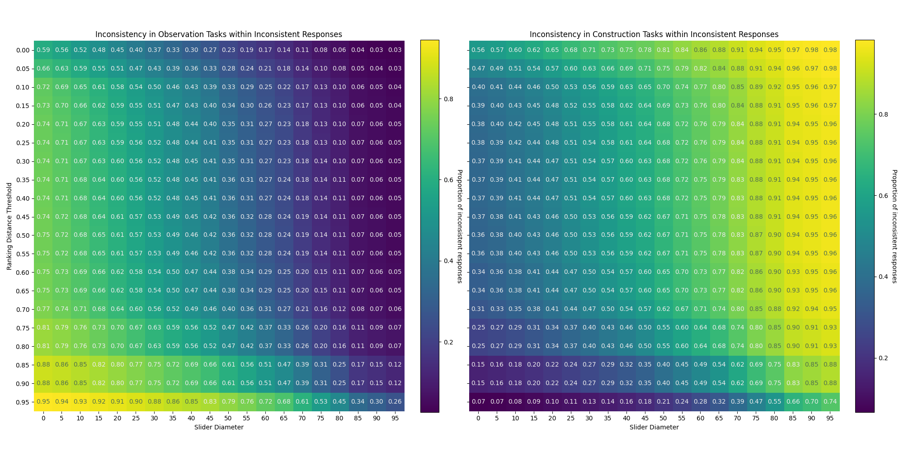

For the same pairs, in the following Figure we demonstrate the distribution of inconsistent tasks for different inconsistency thresholds for both observation, construction and both tasks:

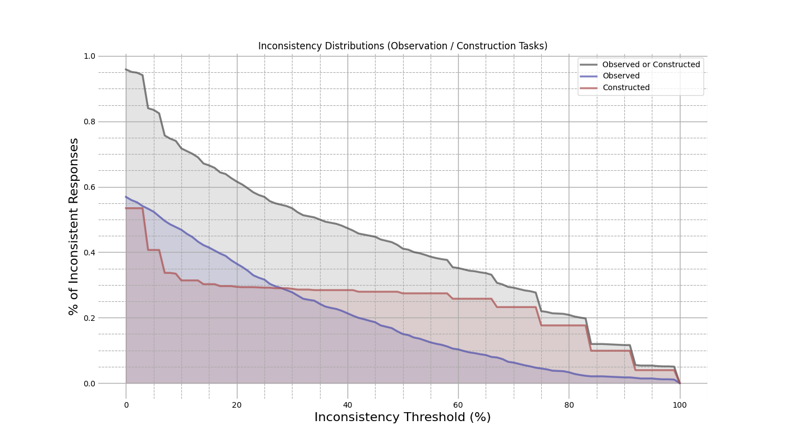

We now focus on the consistency pairs used in each task to verify user response consistency. In the following Figure, we overlay the above distributions (denoted as "Control" distributions) with the corresponding distributions for the inconsistency test pairs:

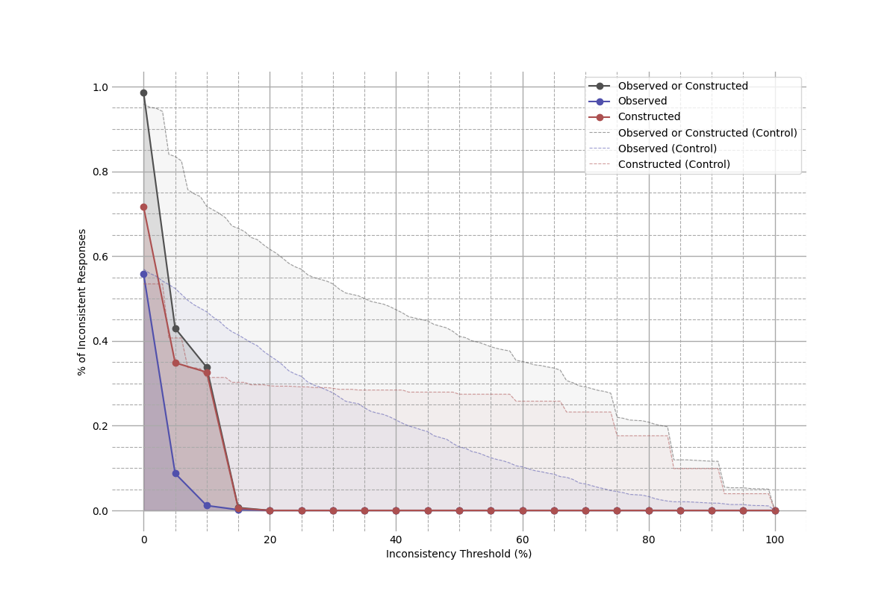

Evidently, the inconsistenty test distributions vanish rapidly, compared to control inconsistency distributions, which adds trust to collected responses.

### So, What Remains?

After all, given that roughly all responses are consistent (in terms of a 15% consistency threshold) and that response times did not hint towards any particular trend &mdash; other than expected ones, we consider reasonable to remove only the first and twelveth questions for each task, i.e., the two demo questions (one per task condition).

## Analysis

In this section, we present a thorough analysis of our data.

### Order Effect

At first, we examine whether the order in which conditions appeared played any significant part in participants responses. Again, we start by response times. In the following Figure we present response time distributions of each condition compared to each other condition it appeared with, with respect to order of appearance:

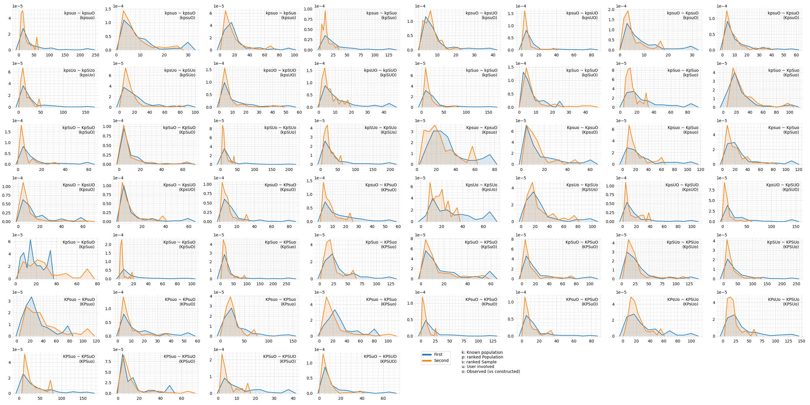

Each Figure is labelled with respect to each of the five examined variables by a five-letter string, where:
* `k` corresponds to to whether the underlying population is known or not;
* `p` refers to whether the population (if known) is ranked or not;
* `s` refers to whether the sample is ranked or not;
* `u` refers to whether the user is assign with a class, or not;
* `o` refers to whether diversity is observed or constructed.

In any case, capital letters refer to `True` assignments of the above variables and lower-case letters to `False`. So, for instance, a condition described by `kpSuO`, we refer to a condition where population is unknown, the presented sample is ranked, the user is not involved and diversity is observed.

Observe at first how all response time distributions are right-skewed. Apart from that, in the majority of distibutions, order of appearance does not seem to play a significant role regarding participant response time. In any case (with the exception of two conditions), distributions correspnding to the condition appearing second seem to be more right-skewed, which may be attributed to tireness. The most significant exception to this appears to be `KpSuo`, were the distribution corresponding to the condition appearing first seems to have taken more time. One may interpret this difference based on this specific task's complexity (constructing a ranked sample from an unranked population, as diverse as possible).

We proceed with observation tasks, where we look throughout all pairs of such tasks for any order effects. The corresponding box-plots are shown in the following Figure, where:
* orange lines correspond to Q2;
* boxes correspond to Q1 - Q3 intervals;
* vertical bars cover the interval [Q1 - 1.5 * IQR, Q3 + 1.5 * IQR], where IQR is the inter-quartile radius, Q3 - Q1.
* red dots correspond to mean values.

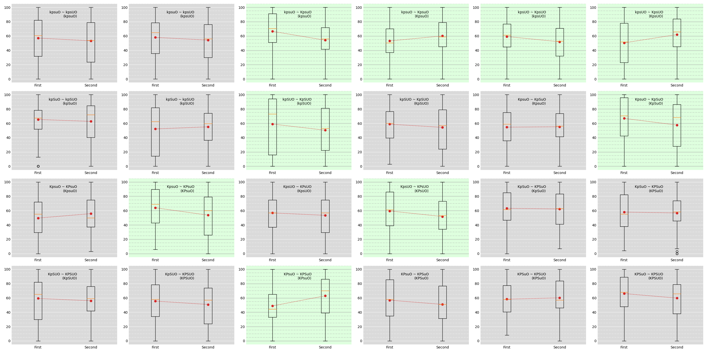

As one may observe, there are cases where order seems to matter. In order to quantify this effect, we have performed a two-tailed Mann-Whitney-U test (MWU) with a 5% confidence level. The highlighted plots in the above Figure correspond to those cases where a significant order effect is observed ($p<.05$, normalized Mann-Whitney $U>2.09$).

*It remains to provide similar plots for diversity, as assessed in observation tasks and for a similar metric of diversity for construction ones (or, probably, all related metrics of diversity we intend to cite).*

### Comparing Conditions

We proceed with compairing pairs of conditions.

### Observing Divrersity

In the following Figure, we present all pairs of observation tasks, where:
* orange lines correspond to Q2;
* boxes correspond to Q1 - Q3 intervals;
* vertical bars cover the interval [Q1 - 1.5 * IQR, Q3 + 1.5 * IQR], where IQR is the inter-quartile radius, Q3 - Q1.
* red dots correspond to mean values.

Also, we have highlighted any pairs where significant differences between the two distributions are observed (normalized Mann-Whitney $U>1.99$, $p<.05$ two-tailed, effect sizes $f>55\%$):

#### Constructing Diversity

We start by considering the simplest cases of construction tasks, i.e., `kpsuo`, `kpSuo`, `kpsUo` and `kpSUo`. In the following Figure we present the distribution of each class in the `kpsuo` condition:

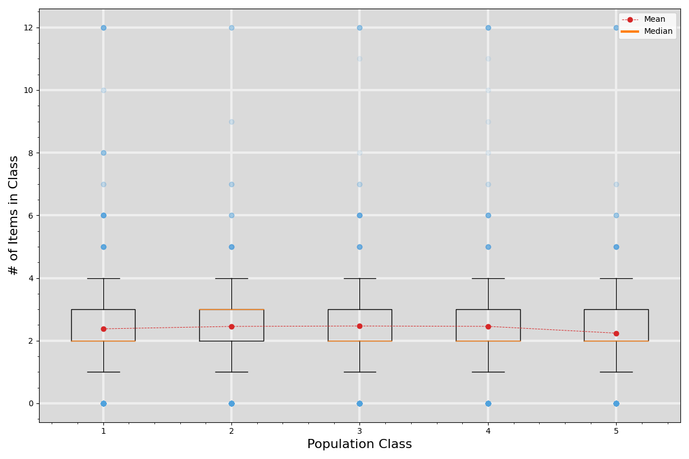

So far so good, since all population class distributions seem identical. Indeed, population classes seem to share almost the same distributions when it comes to medians, Q1, Q3 and outliers. Also, the first four of them seem to have similar (**this needs more concise statistical explanation**) mean values. As for the last class, the slight decline in the average number of its items contained in constructed samples, it might be attributed to divisibility. While the desired sample should contain 12 items, there where five classes to choose from in this case, so many participants seem to have realized that as soon as they arrived to the last part of the sample.

Below, we present the same plot for the ranked counterpart of `kpsuo`, i.e., `kpSuo`:

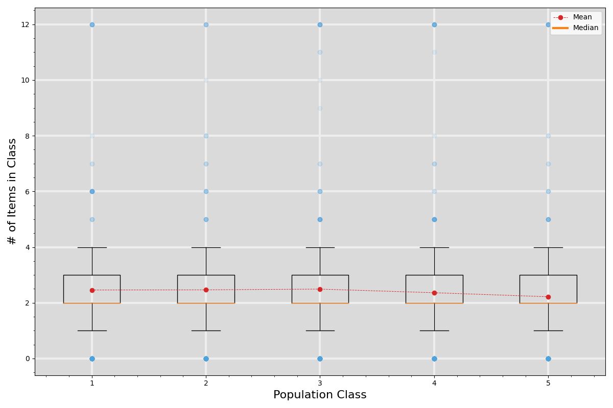

The results (again, as expected) are identical. Indeed, participants seem to have tried to distribute all classes equally, modulo any restrictions mentioned above. However, since any constructed samples were requested to be ordered, we should also examine how the five (5) available population classes where distributed across the twelve (12) sample positions:

There is a clear "oscillating trend regarding which class is mostly preferred in each sample position, which might be illustrated better in the following Figure:

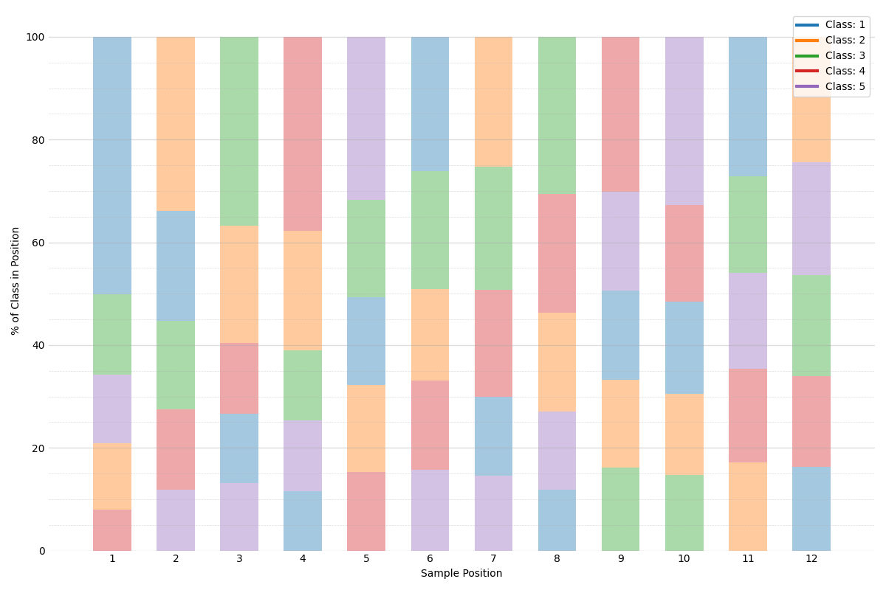

In the above plot, classes in each bar are sorted (top-to-bottom) by their share in that position. There is an apparent pattern regarding the most frequent class in each position.

We present below the same plots as above but for `kpSUo`, i.e., `kpSuo` but where each participant is assigned to a class:

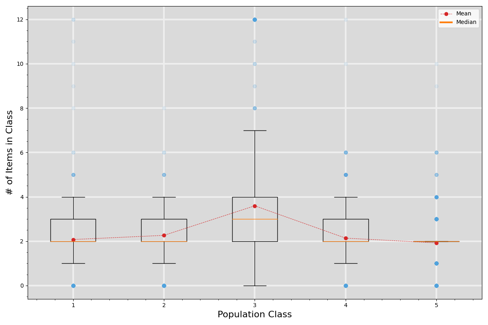

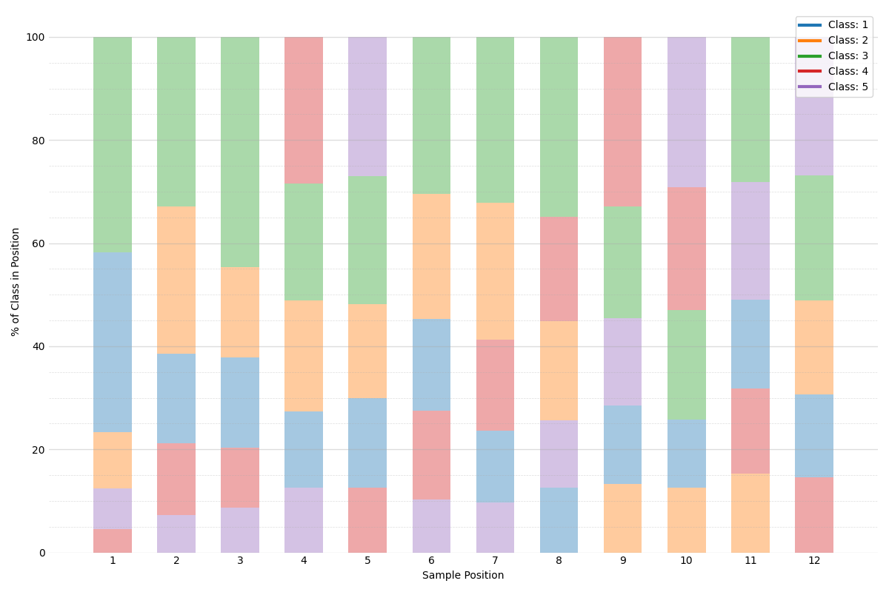

In both plots we observe that the class that was systematically assigned to each participant (i.e., the third one in this case), was over-represented, compared to the rest. This is also reflected into the ditribution of each sample position, where the third class (i.e., the one assigned to each participant) is preferred into most sample positions. Significantly, while there was a clear pattern when it came to ranked samples &mdash; where the most preferred classes for each position were interchangeably all population classes, appearing in the order they appeared in the sample &mdash; this is not the case when users are assigned to a class. Namely, in most positions (1 - 3, 6 - 8, 11) the most preferred class is each participant's class. Similar distribution is observed for `kpsUo`; the unranked counterpart of `kpSUo`:

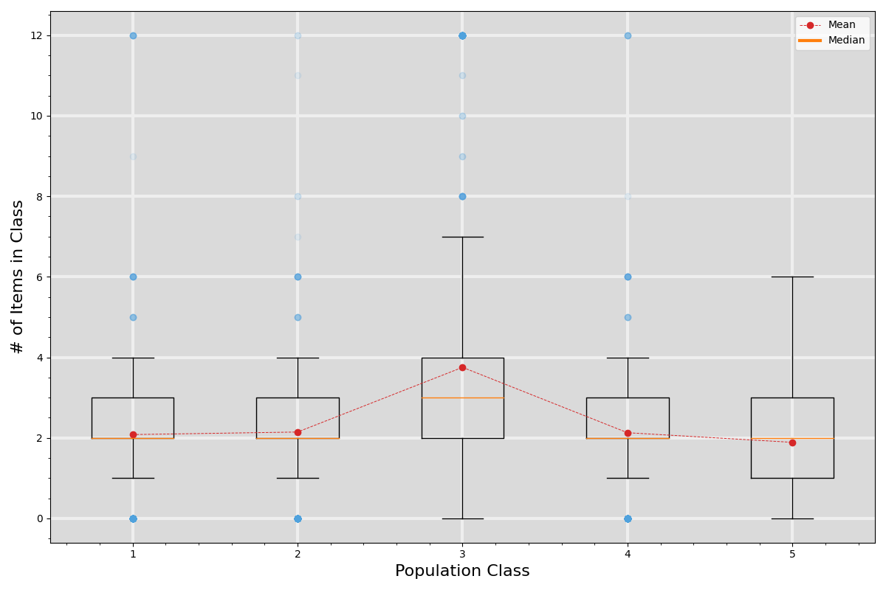

## Key Takeaways

1. Regarding the simple construction scenarios, it seems important for the (relative) majority of participants to maintain a variety in ranking positions, i.e., participants chose to put members of different classes to adjacent positions, so as to ensure that all classes have a representative in a high enough position.
2. In simple scenarios, where participants where assigned to a class and constructed a maximally diverse sample under no other assumptions, user involvement seemed to play a role in sample construction. However, given the artificial setting of our study, we should be moderate in any judgements we make regarding user involvement and its role in the perception of diversity.

## TODOs

* We need a section where we examine the effect of each condition (aggregating over all other).
* We need to demonstrate for each pair of conditions, the effect of the new variable. This can be done by focusing on a single dimension (but for construction/observation) and then examining all pairs (staying within observation and/or construction tasks each time) observe any differences.