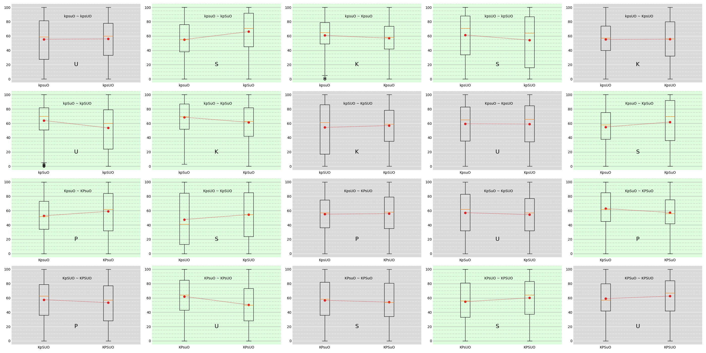
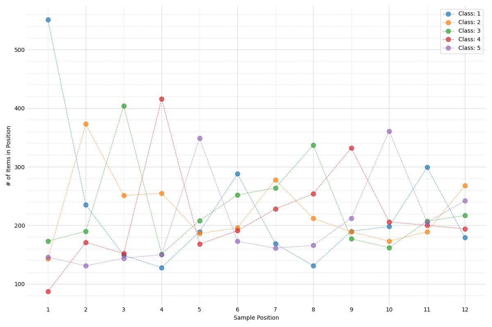

# Data Analysis

Draft notes on Diversity Perception Experiments.


## Data Cleaning

In this section, we discuss any data cleaning we performed on our dataset.

### Response Times

At first, we present response times per condition (logaritmic y-axis):


Evidently, tasks requiring users to build a sample take significantly much time compared to simple diversity recognition tasks. Apart from that, we observe that there are some outliers that seem to have take absurdly too long to complete. Namely, there exist several responses that seem to have taken more than 1000 seconds while one of them required roughly 10,000 seconds.

Given that, we proceed with a more in-depth analysis of response times. At first, we measure the average response time per participant as well as the corresponding standard deviations ($\mu$ and $\sigma$ respectively) and focus on participants that have provided at least one response in time $t$ such that $|t-\mu|>3\sigma$. Notably, there were 571 such participants so we had to refine our search criteria. After a second iteration we found out that for all these 571 participants it was true that $|t_k-\mu|\in(3\sigma,3.3\sigma)$, $k=1,\ldots,571$. Given the number of such users we decided to focus on users that had at least two "late" response (which we found to be 79). In file `outliers_3.json` one may find more details about which questions participants took more time to respond and in which conditions. There seems to appear no significant pattern in terms of conditions or responses, but for the fact that, for the vast majority of those participants, there was one "late" response in each condition. Also, surprisingly enough, it usually was not the first one &mdash; nor any particular response. Bearing in mind the above, **we decided to make no exclusions based on response time**.

### Response Consistency

Each participant, was presented with 22 questions, split into two equal groups of 11 questions (each group corresponding to one of the 24 conditions we wished to study). Within each group of questions, the first one was a demo question, while there were two pairs of questions that were identical, so as to account for response consistency. At first, we define two metrics of inconsistency, corresponding to the observed and constructed type tasks:

* Regarding observed diversity, where participants are asked to drag a slider to determine the diversity (from 0 to 100) of a sample, we consider the distance between slider values in two different questions as a measure of their (in)consistency.
* Regarding constructed diversity, we consider two cases:
    * In case of ranked samples, we measure their distance by consider the (noramlized) Hamming distance of the two rankings &mdash; i.e., the total "displacement" between the two rankings;
    * In case of unranked samples, we measure the (normalized) L1-distance (Manhattan distance) between the two (ordered) sample distributions.

For each case, we use two thresholds:
* The "slider diameter" which is the maximum distance two responses might differ in case of observed diversity tasks and;
* The "distance threshold" which is the maximum normalized (Hamming of Manhattan) distance two constructed samples might differ.

In the following Figure we can observe the distribution of relative frequencies of inconsistent responses for both constructed and observed diversity as a function of slider diameter and distance threshold for a random pair of responses per condition per task:


For the same pairs, in the following Figure we demonstrate the distribution of inconsistent tasks for different inconsistency thresholds for both observation, construction and both tasks (on the left). On the right, we overlay the above distributions (denoted as "Control" distributions) with the corresponding distributions for the inconsistency test pairs::

| | |
| --- | --- |
|  |  |

Evidently, the inconsistenty test distributions vanish rapidly, compared to control inconsistency distributions, which adds trust to collected responses.

### So, What Remains?

After all, given that roughly all responses are consistent (in terms of a 15% consistency threshold) and that response times did not hint towards any particular trend &mdash; other than expected ones, we consider reasonable to remove only the first and twelveth questions for each task, i.e., the two demo questions (one per task condition).

## Analysis

In this section, we present a thorough analysis of our data.

### Order Effect

At first, we examine whether the order in which conditions appeared played any significant part in participants responses. Again, we start by response times. In the following Figure we present response time distributions of each condition compared to each other condition it appeared with, with respect to order of appearance:


Each Figure is labelled with respect to each of the five examined variables by a five-letter string, where:
* `k` corresponds to to whether the underlying population is known or not;
* `p` refers to whether the population (if known) is ranked or not;
* `s` refers to whether the sample is ranked or not;
* `u` refers to whether the user is assign with a class, or not;
* `o` refers to whether diversity is observed or constructed.

In any case, capital letters refer to `True` assignments of the above variables and lower-case letters to `False`. So, for instance, a condition described by `kpSuO`, we refer to a condition where population is unknown, the presented sample is ranked, the user is not involved and diversity is observed.

Observe at first how all response time distributions are right-skewed. Apart from that, in the majority of distibutions, order of appearance does not seem to play a significant role regarding participant response time. In any case (with the exception of two conditions), distributions correspnding to the condition appearing second seem to be more right-skewed, which may be attributed to tireness. The most significant exception to this appears to be `KpSuo`, were the distribution corresponding to the condition appearing first seems to have taken more time. One may interpret this difference based on this specific task's complexity (constructing a ranked sample from an unranked population, as diverse as possible).

We proceed with observation tasks, where we look throughout all pairs of such tasks for any order effects. The corresponding box-plots are shown in the following Figure, where:
* orange lines correspond to Q2;
* boxes correspond to Q1 - Q3 intervals;
* vertical bars cover the interval [Q1 - 1.5 * IQR, Q3 + 1.5 * IQR], where IQR is the inter-quartile radius, Q3 - Q1.
* red dots correspond to mean values.


As one may observe, there are cases where order seems to matter. In order to quantify this effect, we have performed a two-tailed Mann-Whitney-U test (MWU) with a 5% confidence level. The highlighted plots in the above Figure correspond to those cases where a significant order effect is observed ($p<.05$, normalized Mann-Whitney $U>2.09$).

*It remains to provide similar plots for diversity, as assessed in observation tasks and for a similar metric of diversity for construction ones (or, probably, all related metrics of diversity we intend to cite).*

### Observing Divrersity

In the following Figure, we present all pairs of observation tasks, where:
* orange lines correspond to Q2;
* boxes correspond to Q1 - Q3 intervals;
* vertical bars cover the interval [Q1 - 1.5 * IQR, Q3 + 1.5 * IQR], where IQR is the inter-quartile radius, Q3 - Q1.
* red dots correspond to mean values.

Also, we have highlighted any pairs where significant differences between the two distributions are observed (normalized Mann-Whitney $U>1.99$, $p<.05$ two-tailed, effect sizes $f>55\%$):



We observe that in all but one cases (`KPsuo` vs `KPSuo`), whether the sample is ranked or not plays a significant role in terms of user responses. The statistically insignificant change observed between conditions `KPSuo` and `KPsuo` might be attributed to the fact that the underlying population is known and *ranked*, thus both the sample distribution and ranking might be correlated with those of the population (this seems, indeed, to be the case, as we discuss below).

On the other extreme, in all but one cases (`KPsuo` vs `KPsUo`), user involvement seems to play no significant role in parceived participant diversity. This might hint to other criteria (in this case, whether population is known and/or ranked) playing a more important role in how participants assess diveristy, while user involvement comes into play only in the ambiguous case when the underlying **population is known and ranked** while the requested **sample is unranked**.

Regarding population knowledge and whether it is ranked or not, both seem to play some role in some cases while not in others (2/4 in both cases).

### Constructing Diversity

We start by considering the simplest cases of construction tasks, i.e., `kpsuo`, `kpSuo`, `kpsUo` and `kpSUo`. In the following Figure we present the distribution of each class in the `kpsuo` condition:

| | |
| --- | --- |
|  |  |

So far so good, since all population class distributions seem identical. Indeed, population classes seem to share almost the same distributions when it comes to medians, Q1, Q3 and outliers. Also, the first four of them seem to have similar (**this needs more concise statistical explanation**) mean values. As for the last class, the slight decline in the average number of its items contained in constructed samples, it might be attributed to divisibility. While the desired sample should contain 12 items, there where five classes to choose from in this case, so many participants seem to have realized that as soon as they arrived to the last part of the sample.

In the above Figure, on the right, we present the same plot for the ranked counterpart of `kpsuo`, i.e., `kpSuo`. The results (again, as expected) are identical. Indeed, participants seem to have tried to distribute all classes equally, modulo any restrictions mentioned above. However, since any constructed samples were requested to be ordered, we should also examine how the five (5) available population classes where distributed across the twelve (12) sample positions:

| | |
| --- | ---|
|  |  |

There is a clear "oscillating trend regarding which class is mostly preferred in each sample position, which might be illustrated better in the above Figure (right). There, classes in each bar are sorted (top-to-bottom) by their share in that position. There is an apparent pattern regarding the most frequent class in each position.

However, the above is a macroscopic trend, since we obsreve that after aggregating over all participants response, we get that preference distribution per sample position. Nevertheless, it might be the case that no participants acted like that. Indeed, what is shown in the following Figure verifies the above thought. There, we present the number of participants that followed the assumed alternating pattern throughout their constructed samples (blue curve). As one may observe, there were exactly 0 participants that followed that pattern past position 6, i.e., once all classes had been distributed, they did not stick to their strategy. The rest of the plots indicate fidelity to the alternating pattern with 1 or more (up to 4) exceptions, for comparison.


We present below the same plots as above but for `kpSUo`, i.e., `kpSuo` but where each participant is assigned to a class:

| | |
| --- | --- |
|  |  |

In both plots we observe that the class that was systematically assigned to each participant (i.e., the third one in this case), was over-represented, compared to the rest. This is also reflected into the ditribution of each sample position, where the third class (i.e., the one assigned to each participant) is preferred into most sample positions. Significantly, while there was a clear pattern when it came to ranked samples &mdash; where the most preferred classes for each position were interchangeably all population classes, appearing in the order they appeared in the sample &mdash; this is not the case when users are assigned to a class. Namely, in most positions (1 - 3, 6 - 8, 11) the most preferred class is each participant's class. Similar distribution is observed for `kpsUo`; the unranked counterpart of `kpSUo`:


We consider next the case where participants were requested to construct an unranked sample having knowledge of the underlying unranked population (`Kpsuo`) with no other restrictions. In order to account for the effect of population awareness in this case, we consider the difference between the corresponding sample and population distributions per item, as measured by Total Variation Distance (TVD), defined as follows: $TVD(p,q)=\sup_{A\subseteq\Omega}\lVert p(A)-q(A)\rVert$, which in our case reduces to: $TVD(p,q)=\frac{1}{2}\lVert p-q\rVert_1$, i.e., the half of the $\ell_1$ distance of the corresponding probability mass funcions. The maximum value of TVD is 1 and occurs only in case the two distributions are entirely differrent &mdash; i.e., there is no event in which both distributions assign possible probability. The minimum value of TVD (0) means that the two distributions are identical (in our case of a finite measure space).

In the following Figure, we present the distribution of TVD for all tasks corresponding to `Kpsuo`, alongside the mean TVD and the corresponding Q1, Q2, Q3:


The distribution is significantly skewed, favoring lower values of TVD ($\mu=0.235$, $Q_1=Q_2=0.0167$, $Q_3=0.0262$, $\sigma=0.0143$). We also present the same plots for ocnditions `KpsUo`, `KpSUo` and `KpSuo`:

| | |
| --- | --- |
|  |  |
|  |  |

In the following Table we summarize the results shown above:

| Condition |  Mean  |  Std   |   Q1   |   Q2   |   Q3   |
| ---       |  ---   |  ---   |   ---  |   ---  |  ---   |
| `Kpsuo`   | 0.0235 | 0.0143 | 0.0167 | 0.0167 | 0.0262 |
| `KpsUo`   | 0.0310 | 0.0166 | 0.0167 | 0.0250 | 0.0333 |
| `KpSuo`   | 0.0241 | 0.0217 | 0.0167 | 0.0167 | 0.0333 |
| `KpSUo`   | 0.0290 | 0.0236 | 0.0167 | 0.0167 | 0.0333 |

While the theoretical maximum value of TVD is 1.0, in our case, where we draw a sample half the size of the population, TVD may not take values larger than 0.5. Consequently, we shall normalize the values in the above table, dividing all values by 0.5:

| Condition |  Mean  |  Std   |   Q1   |   Q2   |   Q3   |
| ---       |  ---   |  ---   |   ---  |   ---  |  ---   |
| `Kpsuo`   | 0.0470 | 0.0286 | 0.0333 | 0.0333 | 0.0524 |
| `KpsUo`   | 0.0620 | 0.0332 | 0.0333 | 0.0500 | 0.0667 |
| `KpSuo`   | 0.0482 | 0.0434 | 0.0333 | 0.0333 | 0.0667 |
| `KpSUo`   | 0.0580 | 0.0472 | 0.0333 | 0.0333 | 0.0667 |

The above (re-)normalization would scale the x-axis by a factor of two.

We repeat the above analysis in the corresponding ranked cases, were the underlying population is ranked (i.e., `KPSuo`, `KPSUo`, `KPsuo`, `KPsuo`). The corresponding plots are as follows:

| | |
| --- | --- |
|  |  |
|  |  |

Moreover, the (re-)normalized statistics for each condition are shown in the following Table:

| Condition |  Mean  |  Std   |   Q1   |   Q2   |   Q3   |
| ---       |  ---   |  ---   |   ---  |   ---  |  ---   |
| `KPsuo`   | 0.0523 | 0.0377 | 0.0333 | 0.0500 | 0.0667 |
| `KPsUo`   | 0.0565 | 0.0317 | 0.0333 | 0.0500 | 0.0667 |
| `KPSuo`   | 0.0600 | 0.0302 | 0.0333 | 0.0500 | 0.0667 |
| `KPSUo`   | 0.0553 | 0.0283 | 0.0333 | 0.0500 | 0.0667 |

The trends are similar to the ones observed for the unranked case, just less skewed &mdash; observe how all means are larger than those of the corresponding unranked conditions. Again, the rationale seems to be the same: participants' choices when it comes to sample distribution are influenced by the unerlying population's distribution. However, since we are considering ranked populations, it also makes sense to examine any effects of ranking regarding the two conditions where both population and sample were ranked. Given that each ranked sample is constructed as a subsequence of a ranked one, one way to measure their dissimilarity would be to think of each ranked sequence as a string from a five-letter alphabet (one letter per population class), so the sample can be generated from the population through deletions (always 12) and a permutation of the remaining elements. If one thinks of a permutation as a sequence of substitutions, then it makes sense to use a variant of the Levenshtein metric to measure distance between population and sample rankings. Namely, since each sample is by 12 items shorter than the corresponding population, we shall denote by $\tilde{\ell}(x,y)$ the Levenshtein distance of $x,y$ reduced by 24-12=12 units, so, $\tilde{\ell}:={\rm lev}(x,y) - 12$. Note that the minimum value of $\tilde{\ell}$ is 0, in case the two rankings coincide, while its (theoretically) maximum value is 12, in case one needs to permute any sample element to match the population ranking (after the appropriate deletions).

The corresponding distributions (as histogreams) are shown below:

| | |
| --- | --- |
|  |  |

The corresponding statistics are shown in the following Table:

| Condition |  Mean  |  Std   |   Q1   |   Q2   |   Q3   |
| ---       |  ---   |  ---   |   ---  |   ---  |   ---  |
| `KPSuo`   | 4.0341 | 2.7495 |    1   |    5   |    6   |
| `KPSUo`   | 3.6656 | 2.6080 |    1   |    3   |    6   |

Observe that in both conditions, about half of the samples have a Levensthein distance of at most 5 from the corresponding ranked population, which means that with at most 5 substitutions, deletions or insertions, one may obtain the ranked sample from the ranked population.

While substitutions are related to permutations, insertions and deletions are not, so we should also consider another metric which captures our case more concretely. One approach would be to consider the following measure (not necessarily metric) of dissimilarity between ranked populations and samples:

```python
# n = size of population
# m = size of sample
# pop = population ranking in terms of classes
# sample = sample ranking in terms of classes

def custom_distance(sample, pop):
    for i = 0,2,4,...,22:
        pop_1 = pop[i]
        pop_2 = pop[i + 1]
        sam = sample[i / 2]
        d = 0
        if pop_1 != sam and pop_2 == sam:
            d += 1
        return d
```

That is, we split the ranked population into twelve consecutive pairs and compare each of them with the corresponding sample item. If the sample item's class is not one of classes appearing in the corresponding pair, we increase the distance of the two sequences by one. Essentially, we first reduce the population to a set of consecutive pairs of its items and then take a quasi-Hamming distance between that reduced population and the sample. While this function might not yield a metric, in case this takes consistently low values throughout our dataset (for relevant conditions), this shall mean that the ranking of the sample resembles that of the consecutive *pairs* of the corresponding population.

The distributions of these metrics are shown below:

| | |
| --- | --- |
|  |  |

The corresponding statistics are shown in the following Table:

| Condition |  Mean  |  Std   |   Q1   |   Q2   |   Q3   |
| ---       |  ---   |  ---   |   ---  |   ---  |   ---  |
| `KPSuo`   | 3.5434 | 1.4918 |    3   |    4   |    5   |
| `KPSUo`   | 3.3574 | 1.4215 |    3   |    3   |    4   |

Compared to the maximum value of 12 this measure may attain, observe that 75% of the values are up to 4 (i.e., up to the 33% of the possible values). One could make a modest claim that sample and population rankings are somewhat similar with respect to this measure, in the sense that for any sample, there are at least 12 - 5 = 7 of its elements (i.e., more than half) that coincide with their corresponding population pair.

Another possibly appropriate metric might be the Hamming distance between a ranked sample and the initial part of the corresponding population of equal length. In this case, systematically low values would translate to participants taking mostly into account the first part of the ranked population. The corresponding plots are shown below:

| | |
| --- | --- |
|  |  |

The corresponding statistics are shown in the following Table:

| Condition |  Mean  |  Std   |   Q1   |   Q2   |   Q3   |
| ---       |  ---   |  ---   |   ---  |   ---  |   ---  |
| `KPSuo`   | 8.3740 | 2.5597 |    8   |    9   |   10   |
| `KPSUo`   | 8.6573 | 2.1732 |    8   |    9   |   10   |

There seems to be no significant correlation between sample ranking and the ranking of the corresponding population initial part. To further stress this, we present below the corresponding plots using normalized Manhattan distance as our metric:

| | |
| --- | --- |
|  |  |

The corresponding statistics are shown in the following Table:

| Condition |  Mean  |  Std   |   Q1   |   Q2   |   Q3   |
| ---       |  ---   |  ---   |   ---  |   ---  |   ---  |
| `KPSuo`   | 0.3484 | 0.1207 | 0.2917 | 0.3750 | 0.4167 |
| `KPSUo`   | 0.3442 | 0.1007 | 0.2917 | 0.3542 | 0.3958 |

Again, there appears no significant right skewness, which would hint towards a high similarity between sample and the first half of population rankings.

### User Involvement

So far, we have examined the effect of user involvement in terms of simlpe construction tasks, where it made a significant difference (again, with modesty), shifting both sample distribution and ranking towards the participants' class. However, as we discussed above, invilvement seemed to play little to no role when it came to observation tasks. Thus, we shall now shift our focus to whether assigning a class to participants shifted their preferences in construction tasks, overall.

## Construction vs Observation Tasks

## Measurement

We start with simplest case, where participants were asked to assess the diversity of a given unranked sample. Below we present perceived values against theoretically measured diversity values through various diversity metrics:


Interestingly, participants tend to underestimate (wrt to all metrics) the diversity of what would such metrics consider highly diverse sets, while they seem to overestimate less diverse cases. Overall, while any used metrics seem to capture the underlying trend in assessing diversity, participants seem to be more modest in their judgements compared to the corresponding metrics.

With a similar motivation, we juxtapose the diversity of the constructed samples provided by participants in conditions `kpsuo`, `kpsUo`, `kpSuo` and `kpSUo`. Recall that paprticipants were asked to provide a sample as diverse as possible, so, in case the used metrics were accurate enough, we would expect most to be ranked at rather high values. On the contrary, what we observe in the following Figures is that there are snignificantly enough participants that provided constructions that were ranked as moderately diverse by used metrics (especially when focusing on `kpsuo`, where there were no restrictions in terms of ranking or user involvement).

| | |
| --- | --- |
|  |  |
|  |  |

As expected, in most cases participants construct samples that rank high with respect to all simple diversity metrics.

## Key Takeaways

1. Regarding the simple construction scenarios, it seems important for the (relative) majority of participants to maintain a variety in ranking positions, i.e., participants chose to put members of different classes to adjacent positions, so as to ensure that all classes have a representative in a high enough position.
2. In simple scenarios, where participants where assigned to a class and constructed a maximally diverse sample under no other assumptions, user involvement seemed to play a role in sample construction. However, given the artificial setting of our study, we should be moderate in any judgements we make regarding user involvement and its role in the perception of diversity.
3. In construction tasks where population was known and unranked, we observed that sample and population distributions were significantly similar, indicating that knowledge of the underlying population shifts one's perception of diversity towards the distribution of the population.
4. In observation tasks, it seems that whether the sample is ranked or not has the most significant effect in the perception of diversity, while the least important (modulo any limitations of our study) seems to be user involvement. Regarding population awareness and ranking, they seem to play some part in participants' judgement in some cases, yet not all. 
5. In the above, significantly, the only case in which user involvement seemed to play a part in diversity perception is when all other parameters made the case quite ambiguous, i.e., when the population was known and ranked while the sample not.

## Future Work

1. We should revisit the case of known population and study at a deeper level how population ranking affects sample ranking &mdash; while there are strong indications that participants took ranking into account when it came to simply constructed ranked samples, there does not appear any clear pattern in cases where the (ranked) underlying population was known.
2. One of the major limitations of our study is that the setting is purely artificial. So, any future work should build on any results of this study but extend them in a more realistic setting &mdash; especially when it comes to user involvement, since but for certain simple cases, there seemed to be no significant effect of that variable, so further investigation is needed.
3. We shall also explore more complex cases, where diversity might also be considered in a non-shallow (i.e., deep) manner.

## TODOs

* We need a section where we examine the effect of each condition (aggregating over all other).
* We need to demonstrate for each pair of conditions, the effect of the new variable. This can be done by focusing on a single dimension (but for construction/observation) and then examining all pairs (staying within observation and/or construction tasks each time) observe any differences.
* In the case of `KPSUo` and `KPSuo`, we should investigate how position correlates with ranking fidelity (e.g., whether in the first positions populations and samples are similar or not).